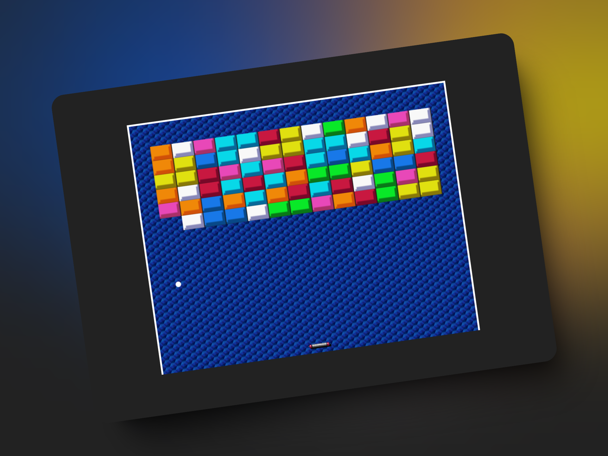
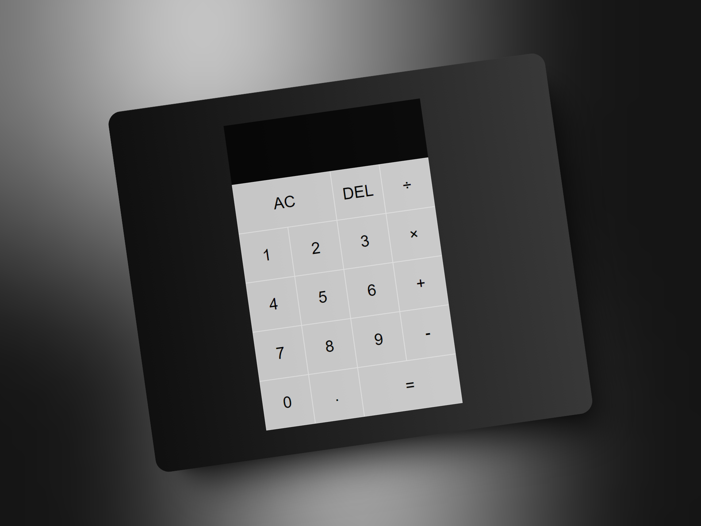
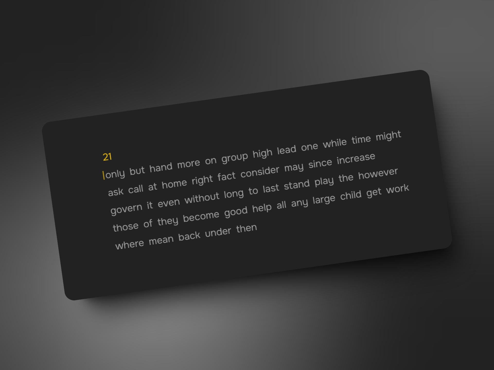

# ✨ Proyectos de JavaScript

|  #   | Proyecto         | Descripción                                                              | Código                                                                                                                                                                                   | Website                                                       |
| --- | ---------------- | ------------------------------------------------------------------------ | ---------------------------------------------------------------------------------------------------------------------------------------------------------------------------------------- | ------------------------------------------------------------- |
| 1   | **Tinder Swipe** | Realiza el efecto de swipe de Tinder con HTML, CSS y JavaScript. |  |  |
| 2   | **Arkanoid Game** | Juego mítico y clásico de Arkanoid para pasar el rato. |  |  |
| 3   | **Calculadora** | Calcula operaciones matemáticas sencillas con esta calculadora moderna. |  |  |
| 4   | **Geo IP App** | Llama a una api para obtener información de cualquier IP. |  |
| 5   | **Typing Game** | Pon a prueba a qué velocidad tecleas. |  |  |
| 6   | **Guess The Word Game** | Adivina la palabra escogida aleatoriamente. |  |  |

- Tinder Swipe

- Arkanoid Game

- Modern Calculator

- Geo IP App

- Typing Game

- Guess The Word Game

